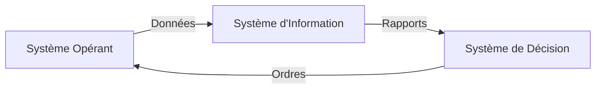

*Note: n'est pas 100% juste*
# Partie 1
## Exercice 1

![[Pasted image 20241119102013.png]]
## Exercice 2

![[Pasted image 20241119101916.png]]
## Exercice 3

![[Pasted image 20241119101827.png]]
## Exercice 4

![[Pasted image 20241119101720.png]]
## Exercice 5

![[Pasted image 20241119101615.png]]
## Exercice 6

![[Pasted image 20241119101456.png]]
# Partie 2
## Exercice 7

**Q1 : Les fonctions auxquelles appartient chaque responsable / service**

1. Achat : Responsable des achats, Service ordonnancement.
2. Production: Directeur de l'usine, Atelier de production.
3. Commercial : Directeur commercial, Service prospection et publicité.
4. Comptabilité et finances : Service comptabilité clients, Service comptabilité fournisseur, Directeur comptable et financier, Service de trésorerie.
5. Gestion des ressources humaines (GRH ou Sociale) : Service formation de personnels, Service de la paie, Directeur du personnel.
6. Directeur : Président Directeur Général, Secrétariat de la direction.

**Q2 : Organigramme de l’entreprise **

![[Pasted image 20241119101100.png]]

**Q3 : Structure de l'organigramme**

La structure est fonctionnelle, car elle regroupe les services selon leurs fonctions spécialisées comme Achat, Production, etc.

## Exercice 8

**Q1: L'organigramme:**

![[Pasted image 20241119101235.png]]

**Q2: Classification:**
- Système de décision: Le directeur
- Système d'information: Les logiciels et ordinateurs des services
- Système opérant: Les services qui font le travail quotidien (assemblage, commercial, comptabilité)

**Q3: Système d'information:**
- Oui, il est automatisé avec:
  * Des logiciels pour chaque service
  * Des ordinateurs avec imprimantes
  * Des agents pour saisir les données

**Q4: Environnement:**
- Fournisseurs
- Clients
- Prestataires informatiques

**Q5: Les interactions entre systèmes:**

## Exercice 9

**Q1: Système décrit :**
- Système de paiement des salaires (actuellement par chèques)

**Q2:Utilisateurs :**
- Personnel RH
- Employés
- Directeur RH

**Q3: Étapes du processus :**
- Fin du mois : déclenchement du processus
- RH examine combien d'employés doivent être payés
- RH prépare et remplit 1200 chèques
- L'employé vient au bureau RH
- L'employé présente sa carte d'identité
- RH vérifie la carte d'identité
- RH remet le chèque à l'employé

**Q4: Détails du processus :**
- Activités : préparation, vérification, distribution (mensuel)
- Données : infos employés, salaires
- Contrôles : vérification carte d'identité

**Q5: Objectif nouveau système :**
- Automatiser les paiements par virement bancaire direct

**Q6: Conditions de réussite :**
- Base de données employés fiable
- Infos bancaires correctes
- Système sécurisé